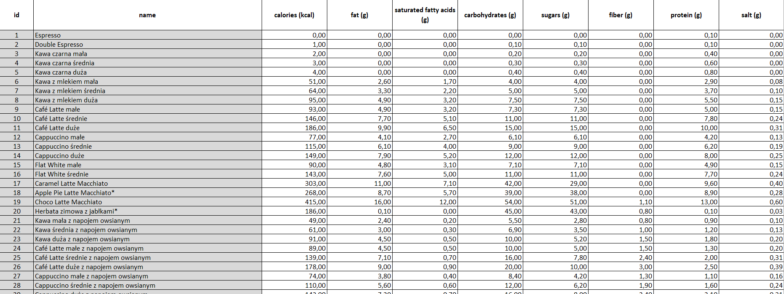
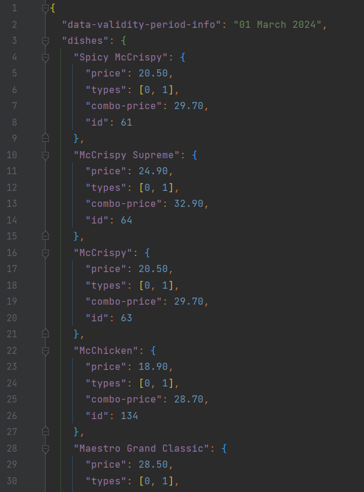
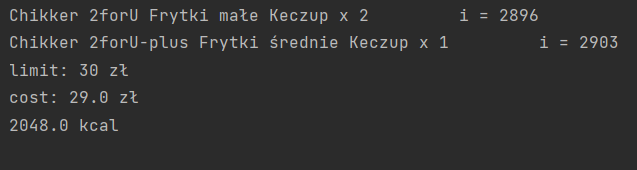
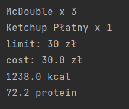

# McDonald's order optimization

## Description

The aim of the project was to obtain data on the nutritional values 
(e.g. kcal, protein, etc.) of meals at McDonald's restaurants
in Poland along with information on the price offer in order 
to optimize the order in terms of selected nutritional values 
while limiting costs (knapsack problem with repetitions).

Data on nutritional values was obtained from a PDF file
available on the Internet by McDonald's (see `352978-tabela-wo-8-11-2023-mop.pdf` file),
then transformed using the free
[online Adobe tool](https://www.adobe.com/pl/acrobat/online/pdf-to-excel.html)
into an Excel spreadsheet file and organized manually (see `products.xlsx` file).

The `products.xlsx`file preview:

Data regarding the current offer of McDonald's restaurants was 
obtained manually from the
[McDonald's application](https://mcdonalds.pl/aplikacja-mobilna/)
(see `offers.json` file).
Due to price differences in individual McDonald's restaurants in Poland, it
was necessary to limit data to data from one specific restaurant: 
McDonald's Warsaw Radość.

The `offers.json`file preview:

To solve the knapsack problem,
[the optimize module](https://docs.scipy.org/doc/scipy/reference/optimize.html)
from the SciPy library was used.

The `load_and_transform_data.py` file contains code for transforming data on nutritional
values and price offers into a form that allows for optimization.
Additionally, it is worth noting that the optimization covers all
possible combinations of McDonald's products in sets (various types
of sandwiches, sides, drinks, sauces, etc.), excluding the 
customization of single meals, such as additional ingredients in a 
sandwich.

## Example results

Number of calories maximization with 30 zł limit:

Number of protein (grams) maximization with 30 zł limit:

## Setup

To use it clone this repository via `git clone <url_of_this_repo>` command in Git Bash
and create virtual environment in directory of cloned repo.\
Then install packages specified in `requirements.txt` file.
